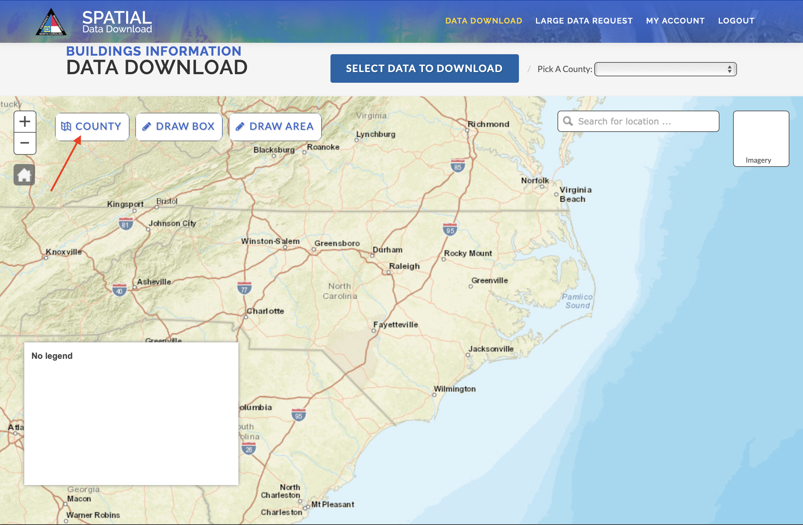
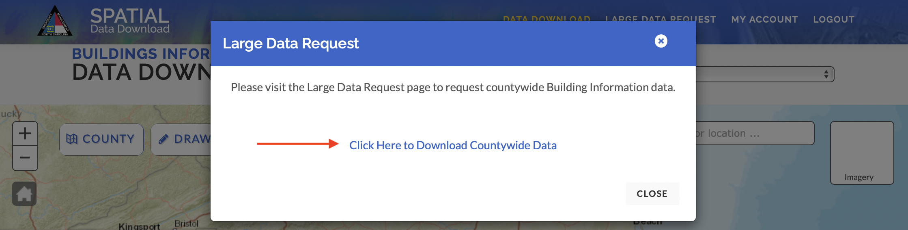
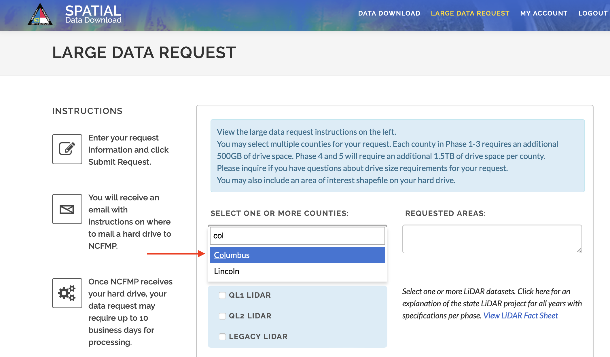
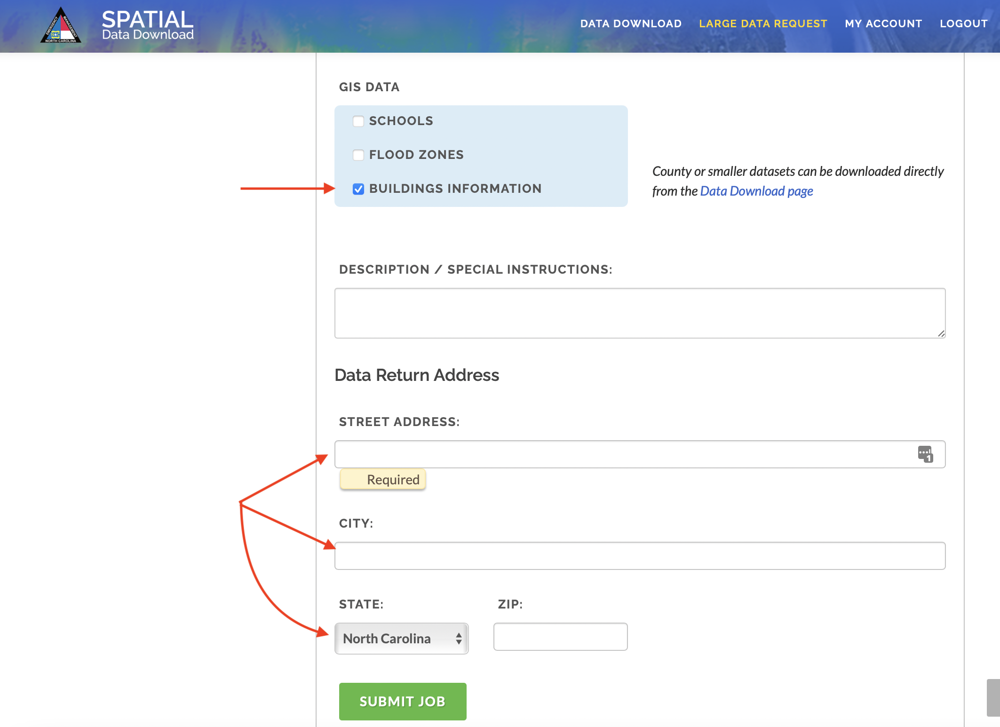
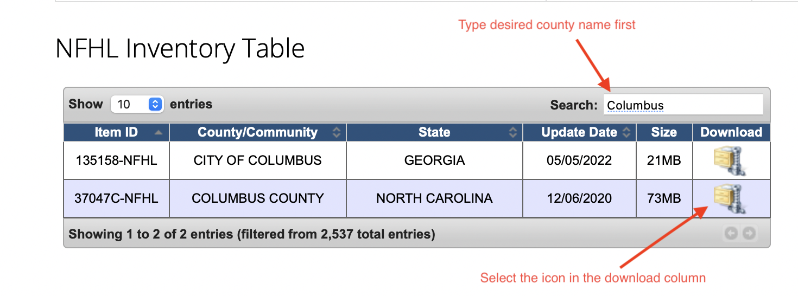

# pai789_final_project

# Investigating Flood Risk and Equity in North Carolina

## Background

As temperatures increase, communities across the globe are expected to experience more extreme weather events. In North Carolina, the state currently experiences both coastal and inland flooding, and is expected to have more flood events due to climate change. Smaller, lower-resourced populations are specifically going to experience the brunt of climate impacts because as these communities experience more natural disasters, residents and employers leave and their tax bases dwindle, thus making it harder to fund basic services. 

This repository investigates Columbus County in North Carolina, but future work can utilize the resources included as a foundation to expand to other counties in the state. The main unit of analysis is the building data found via the North Carolina Spatial Data Download. This repository was created with the goal of helping policy makers and communities better understand their flood risk as well as the communities who live near and within floodplains. 

This repository uses data from Federal Emergency Management Agency (FEMA), the state of North Carolina, and the U.S. Census Bureau to calculate: 

1) The expected depth of flooding (in feet) for parcels that stand in FEMA’s 1% annual flood chance zone

2) Block group-level demographic characteristics that were chosen based on the Environmental Protection Agency’s (EPA) Environmental Justice Indicators. These demographics are at the block-group level and include: 
  * The percent of the population that is non-white hispanic
  * The percent of households where the household income is less than or equal to twice the federal "poverty level”
  * The unemployment rate
  * The percent of households who do not speak English or do not speak English “very well”
  * The percent of people age 25 or older in a block group whose education is short of a high school diploma
  * The percent of people who are under age 5
  * The percent of people who are over age 5

The block-group characteristics not guided by the EPA’s Environmental Justice Indicators but also included in the analysis are:
  * The percent of buildings occupied
  * The percent of buildings owner-occupied
  * Median Income

## Tableau

The output created with the scripts has been put into a Tableau Public project that can be found here: https://public.tableau.com/app/profile/daisy5195/viz/NC_Columbus_County_Flood_Depths/Sheet1?publish=yes

## Folder Structure:

### Scripts 
All scripts will be found with “script[#]...” in front of the script title. The number indicates the order in which the scripts should run. folders that include the script and any input files. 

### Input Files
All input files will be found in this folder, except for “NC_ACS_2018_Shells_FLD.csv” which will be found in the main repository and is used in Script1.

### Images
All images used in the ReadMe file are stored in the “images” folder.

###Raw
The “raw” folder is utilized in Script1 and stores census data from Script1

## Scripts

The scripts of this repository do the following:

### Script1: nc_acs.py

#### A. Summary
This script uses request and pandas modules of Python. The script does the following:
Pulls appropriate demographic data from the ACS from 2018 for your desired county and state identified by the appropriate FIPS codes. These demographics will be used in Script2 to calculate the appropriate demographics inspired by the EPA’s Environmental Justice Indicators. 
Creates two new csv files for block groups (“nc-census-acs-bgs.csv”) and tracts (“nc-census-acs-tracts.csv”). These csv files will be used in script 2

#### B. Input Data
The input data for this script includes:
"NC_ACS_2018_Shells_FLD.csv" which is a csv of the desired demographic data taken from the ACS 2018 Table Shells and shortened to the desired demographics. The 2018 Table Shells for the ACS can be found here: https://www.census.gov/programs-surveys/acs/technical-documentation/table-shells.2018.html 

### Script2: analyze_acs_nc.py

#### A. Summary
This script uses pandas, geopandas,and numpy modules of Python. The script does the following:
Reads the bg and tract csvs created in Script1 and calculates the demographics that will be utilized in the analysis. The script breaks the demographics up by block group and by tract. The tract group variables will be percentages and can therefore be assigned to the block groups.
The script then merges the block group and tract level data into one csv titled "nc_bg_tract_merged.csv"

#### B. Input Data
The input data for this script includes:
“nc-census-acs-bgs.csv”
“nc-census-acs-tracts.csv”
Both of these scripts were created in Script1
 
 
### Script3: geotools.py 

#### A. Summary
This script is written by Professor Peter Wilcoxen and uses geopandas and scipy.spatial and shapely.geometry modules of Python and also imports MultiPoint from shapely.geometry. The script does the following:
Defines a module called “geotools” that will be utilized in script 5.

### Script4: flood_plain_buildings.py

#### A. Summary
This script was written by Peter Wilcoxen and uses geopandas and os modules of Python. The script does the following:
Creates a new geopackage file titled “floodplain-buildings.gpkg” that holds all of the QGIS layers that are used to build the floodplain.
The layers in the geopackage are:
  * buildings: a layer that includes all buildings from the Columbus_FP.gd file that intersect with the floodplain
  * floodplain-bfe: a layer of the areas that do have BFE within the floodplain
  * floodplain-nobfe: a layer of the areas that do not have BFEs within the floodplain
  * bfe: a layer with all of the BFEs with elevations in the FEMA zip file that correspond to 'S_BFE.shp'
  * xs: a layer with all of the XS lines with elevations in the FEMA zip file that correspond to 'S_XS.shp'
  
The input files used in this script are: 
  * 'Columbus_FP.gdb' which provides information for buildings in Columbus County, such as the LIDAR_LAG value used to calculate the expected flood depth.
  * 'FEMA_Flood_HAZ_ColumbusCounty.zip' which provides the FEMA Flood Zone shape files used to construct the flood zone in the county
   

### Script5: flood_sections_static.py

#### A. Summary

This script was written by Peter Wilcoxen and uses geopandas and pandas modules of Python as well as the geotools module created in Script3. The script uses voronois and dissolves to slice the floodplain into sections that correspond to the closest BFE, STATIC_BFE, and XS elevation points. The script also produces a new geopackage titled 'flood-elevation-points.gpkg'.

The input file used is:
 * 'floodplain-buildings.gpkg' which is the geopackage created in Script4

### Script6: join_parcel_demo_tax.py

#### A. Summary
This script uses geopandas, pandas, and os modules of Python and geotools created in the script 3. The script does the following:
Joins the Columbus_FP data, which holds information like the LIDAR_LAG value that is used to calculate the expected flood depth, with the block group level demographics calculated in Script2, and tax parcel information found from Columbus County. This joined spatial data is put into a layer called “ftp_demo” that lives in “flood_levels.gpkg.”

The input file used is:
 * ‘Columbus_FP_Info.gpkg’ which has a layer called ‘Building_Centroids’ that corresponds to the previous Columbus_FP data used in Script4 
 * ‘nc_bg_tract_merged.csv’ which was created in Script2 and holds the desired demographic characteristics guided by the EPA’s environmental Justice Indicators.
 * ‘parcels.shp’ which is from Columbus County and holds relevant tax information, such as the address and tax value of a parcel.

### Script7: flood_depth.py

#### A. Summary
This script uses pandas, geopandas, matplotlib.pyplot, and seaborn modules of Python. The script does the following:
 * Calculates the expected flood depth in feet for each building centroid in the floodplain
 * Creates two histograms: one that shows all of the negative flood depths and one that plots all of the flood depths calculated

The input file used is:
 * ‘Columbus_FP_Info.gpkg’ which has a layer called ‘Building_Centroids’ that corresponds to the previous Columbus_FP data used in Script4 
* "flood_sections_static.gpkg" created in Script5

### Script8: maps-acs.py 

#### A. Summary
This script uses pandas, geopandas, and matplotlib.pyplot modules of  Python. The script does the following:
Creates various maps of the county broken out by the block group level demographics and has the floodplain overlaid. These maps can be utilized to get a sense of what types of communities the floodplain lies on.

## Data Files 
Data files within the repository are sourced from various resources. The appropriate input files will be held within the repository, but you will find instructions below on how to source the data used in this project:

### North Carolina Spatial Data Download:

  * The data from this site include Building Footprint data and DEM data
  * You will have to create an account here to access the data: https://sdd.nc.gov
  * Once logged in, select “County” 
  
  
  
  * Then select “Click Here to Download Countywide Data”
  
  
  * From there, select “Columbus” and the selection will appear in the “Requested Areas” box
  
  
  * Next select “BUILDINGS INFORMATION” and fill out your contact information
   
  * The Building Footprint data will come as a geopackage via email titled: “Columbus_FP_Info.gpkg”

### FEMA Flood Hazard Layers
  * Go to: https://www.floodmaps.fema.gov/NFHL/status.shtml
  * Scroll down until you see “NFHL Inventory Table”
  * Type “Columbus” in the search bar
   

  * Select the download file for “NORTH CAROLINA”
  * The download will be a zip file titled: “FEMA_Flood_HAZ_ColumbusCounty.zip”
  * Two layers will be utilized and are titled:
    * “S_FLD_HAZ_AR.shp”
    * “S_XS.shp”

### Columbus County Tax Data
  * Go to: https://mangomap.com/columbusmis/data/b8123278-d6a7-11e7-98bc-06765ea3034e/parcels
* Select the SHP icon with the down arrow to download the shapefiles of each parcel

